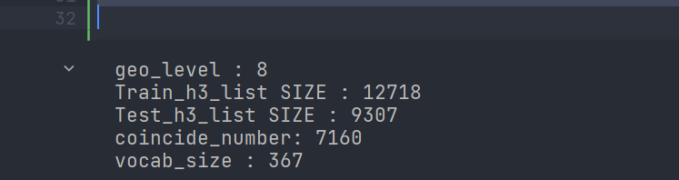

### 本项目没有把geofile的数据clone到github，主要的文件在source中

每个对象20到25是测试集

2022-2-28 现在主要是try05是我们主要写的样例

### 2022-7-24
现在主要是当前10天作为数据集，后10天作为训练集，训练步长是10，预测间隔是1，

最后的的test准确率到0.39，

猜测预测不好的主要原因

如果是那种预测和训练在同一天，间隔是2，offset是1的话，就完全能到0.89
基本准确能达到0.89

首先可以添加一个修正的正确率，

这个数据集多半是在开车的数据集